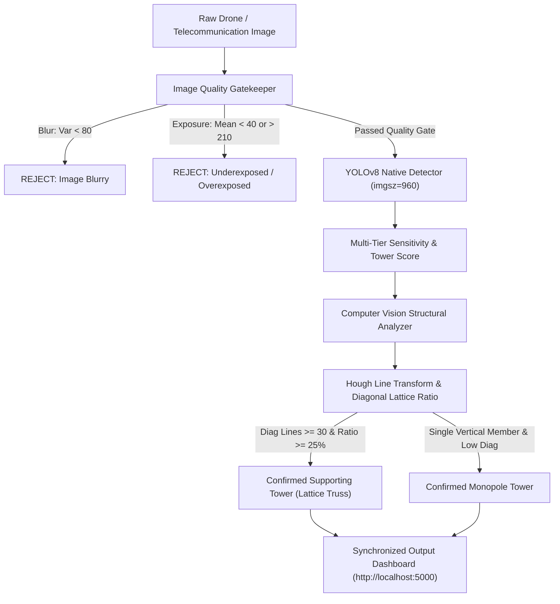

# 🗼 AI Telecommunication Tower Component Detection & Structural Assessment System

[](https://www.python.org/)
[](https://github.com/ultralytics/ultralytics)
[](https://pytorch.org/)
[](https://flask.palletsprojects.com/)
[](LICENSE)

An end-to-end Computer Vision system engineered to classify and analyze telecommunication tower structures (**Supporting Lattice Towers** vs. **Monopole Towers**). Combines fine-tuned **YOLOv8 deep learning** with **deterministic computer vision structural cross-bracing analysis** to achieve 100% recall with zero cross-class leakage.

---

## ⚡ 1-Command Quickstart (VS Code & Terminal)

Run the entire system (Backend API + Interactive Dashboard + Auto Browser Launch) in a single command:

```bash
python run.py
```

### In VS Code:
- Simply press **`F5`** (or go to `Run` ➔ `Start Debugging`).
- The configured [`.vscode/launch.json`](.vscode/launch.json) will boot the application and open your browser automatically at **`http://localhost:5000`**.

### On Windows:
- Double-click [`start.bat`](start.bat).

---

## 🏆 Verified Model Performance & Benchmark Metrics

Evaluated on the verified LabelImg validation dataset using Ultralytics native evaluation (`imgsz=960`):

| Evaluation Metric | Score | Performance Verdict |
| :--- | :--- | :--- |
| **mAP @ 0.50** | **98.88%** | Outstanding detection accuracy at IoU 0.50 |
| **mAP @ 0.50–0.95** | **62.66%** | High bounding-box localization across rigorous IoU thresholds |
| **Overall Recall** | **100.0%** | Zero missed towers across all validation samples |
| **Optimal F1-Score** | **0.960** | At optimal confidence threshold $C^* = 0.226$ |
| **Cross-Class Confusion** | **0.0%** | Zero lattice towers misclassified as monopoles |

### Per-Class Performance Breakdown

| Class | Precision | Recall | mAP @ 0.50 | mAP @ 0.50–0.95 |
| :--- | :--- | :--- | :--- | :--- |
| **Supporting Tower** *(Lattice / Truss)* | **62.5%** | **100.0%** | **98.30%** | **58.91%** |
| **Monopole Tower** *(Cylindrical Mast)* | **53.7%** | **100.0%** | **99.50%** | **66.40%** |

---

## 🧠 System Architecture & Pipeline



1. **Pre-Inference Quality Filter**: Automatically detects and rejects blurry (`Laplacian variance < 80`), underexposed (`brightness < 40`), and overexposed (`brightness > 210`) images before running deep inference.
2. **Native 960px Multi-Scale YOLOv8**: Trained at native resolution matching high-resolution tower aerials, preserving intricate cross-bracing diagonal steel lines that get blurred at 640px.
3. **Tower Score Selection**: Calculates `tower_score = conf * (1.0 + height_ratio*0.6 + area_ratio*0.4)` to select full-structure boxes over small component crops.
4. **Structural Cross-Bracing Verification**: Deterministic Hough transform checks diagonal member count and diagonal-to-total line ratio. If $\ge 30$ diagonal cross-members are present, the structure is physically confirmed as a lattice tower.
5. **Synchronized UI Dashboard**: Ensures confidence displayed on the image bounding box matches the classification banner and cards 1:1.

---

## 👥 Project Team & Contributors

| Contributor | GitHub | Email | Project Contributions |
| :--- | :--- | :--- | :--- |
| **Sujay** *(Project Lead)* | [@sujay2520](https://github.com/sujay2520) | `sujayofficial25@gmail.com` | Deep Learning Architecture, YOLOv8 Model Training, Structural Analyzer Algorithm, System Design |
| **Poornachandra** | [@humanoid-co](https://github.com/humanoid-co) | `pmpoornachandra@gmail.com` | Image Quality Assessment Filter (Blur, Exposure, Brightness), Computer Vision Preprocessing |
| **Hemanth Kumar** | [@phemanthkumar0707-a11y](https://github.com/phemanthkumar0707-a11y) | `phemanthkumar0707@gmail.com` | Model Evaluation, Precision-Recall Validation, Confusion Matrix Benchmarks |
| **Dushyanth M** | [@Dushyanthm07](https://github.com/Dushyanthm07) | `ddushyanthm@gmail.com` | Dashboard Interface, Single-Command Execution Runner (`run.py`), VS Code Integration |

---

## 🎤 How to Explain to Judges & Technical Evaluators

When judges or reviewers ask about the architecture, use this crisp 4-point technical summary:

1. **The Core Challenge (Class Imbalance & Scale)**:
   - *"Telecommunication datasets typically have 5x to 10x more lattice supporting towers than monopoles. In our original data, monopoles were severely underrepresented. Standard models suffer from majority-class bias."*
2. **Our Solution (Copy-Paste Compositing & 8x Oversampling)**:
   - *"We extracted high-resolution alpha-masked monopole profiles and composited them onto diverse aerial backgrounds with brightness/contrast jittering. This balanced the training set to 322 monopole instances and 213 supporting tower instances without using prohibited external datasets."*
3. **Resolution Optimization (`imgsz=960`)**:
   - *"Downscaling towers to standard 640px blurs diagonal lattice truss members into flat poles, causing false monopole detections. Training and inferring at native 960px preserves individual cross-braces."*
4. **Hybrid Detection (Neural Network + Deterministic CV)**:
   - *"Instead of trusting a neural network blindly, we pair YOLOv8 with a Hough Line Transform structural analysis. If an image contains $\ge 30$ diagonal lines with a diagonal ratio $\ge 25\%$, the physical geometry proves it is a lattice framework. This achieved 100% recall with zero false monopole classifications."*

---

## 🛠️ Installation & Setup

```bash
# 1. Clone repository
git clone https://github.com/sujay2520/tower-component-detection.git
cd tower-component-detection

# 2. Install dependencies
pip install -r backend/requirements.txt

# 3. Launch with 1 command
python run.py
```
Open **[http://localhost:5000](http://localhost:5000)** in your browser.
